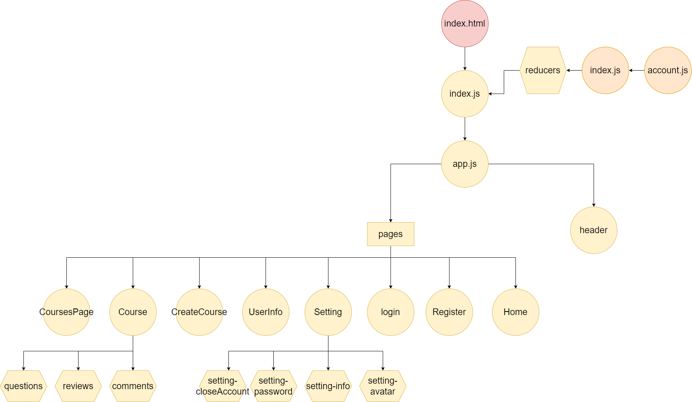

# master-piece-project

## User Stories

- **register:** As an anon I can register to the website
- **Login:** As a user I can login to the website
- **Logout:** As a user I can logout from the website
- **Create course** As a user I can create new course
- **Add lesson** As a user I can add a new lesson to my course
- **Edit Course** As a user I can edit my course
- **Enrole** As a user I can enrole to a course
- **Comment** As a user I can give a comment to a course or lesson
- **Like** As a user I can give a like to a course
- **Follow** As a user I follow other user to watch his future course

## Admin Stories

- **Block user** As an admin I can give a user a block from the website
- **Block comment** As an admin I can block a comment
- **Block course** As an admin I can block a cource

## used library

- [nextjs](https://nextjs.org/)
- [redux](https://www.npmjs.com/package/redux)
- [material ui](https://mui.com/)
- [popup-tools](https://www.npmjs.com/package/popup-tools)
- [sweetalert2](https://sweetalert2.github.io/)

## Routes

| Path                              | Component    | Permissions    | Behavior                                                             |
| --------------------------------- | ------------ | -------------- | -------------------------------------------------------------------- |
| `/`                               | n/a          | public         | Home page                                                            |
| `/register`                       | Register     | public         | Register form, link to login, navigate to log in page after register |
| `/login`                          | Login        | public         | Login form, link to register, navigate to homepage after login       |
| `/search/:term`                   |              | public         |                                                                      |
| `/setting`                        | Setting      | user nad admin | Setting form,                                                        |
| `/userIndo`                       | UserInfo     | user and admin | show other user info                                                 |
| `/create/course`                  | CreateCourse | user and admin | create new course                                                    |
| `/course/:courseTittle`           | Course       | public         | show course                                                          |
| `/courses/:category`              | CoursesPage  | public         | show courses by category                                             |                                            |

## Components

- Header
- Home
- Register
- Login
- Setting
- UserInfo
- CreateCourse
- UserInfo
- Course
- CoursesPage
- Comments
- Reviews
- Questions
- chate

## Diagrams

### UML Diagrams

 

## wireframes

### home page

 

### register page

 

### login page

 

### setting info page

 

### setting avatar page

 

### setting password page

 

### setting close account page

 

## Links

### GitHub

[Client repository Link](https://github.com/MB-Project-Mohammed-Almuziny/client)

[Server repository Link](https://github.com/MB-Project-Mohammed-Almuziny/server)

[Deployed App Link](https://mb-almuzainy.netlify.app/)

### Trello

[Link to trello board](https://trello.com/mbprojectmohammedalmuziny)

### Slides

[Slides Link](http://slides.com/)
